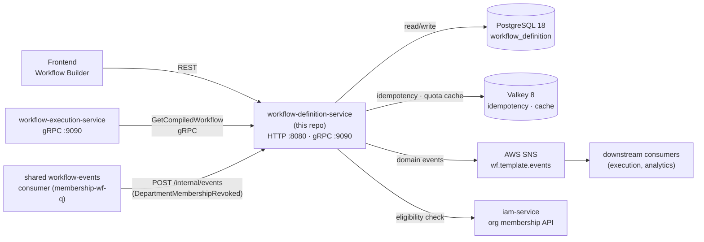
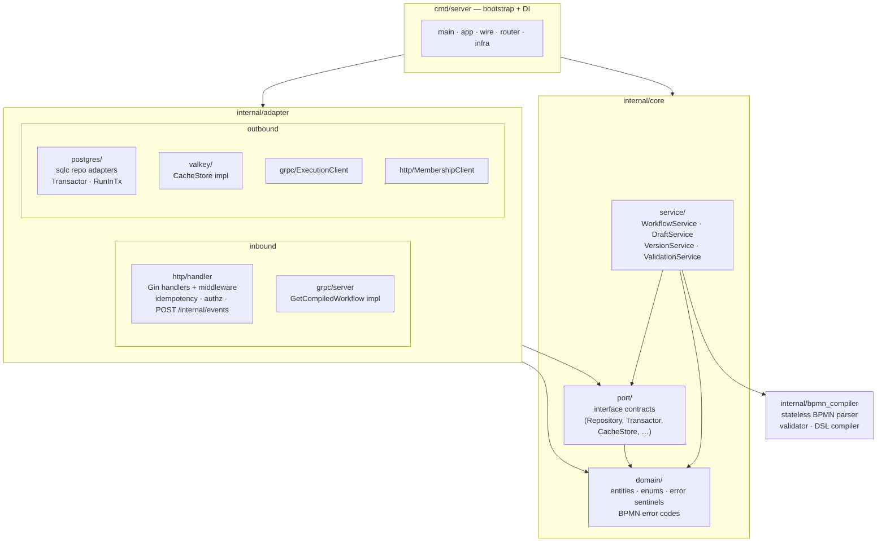
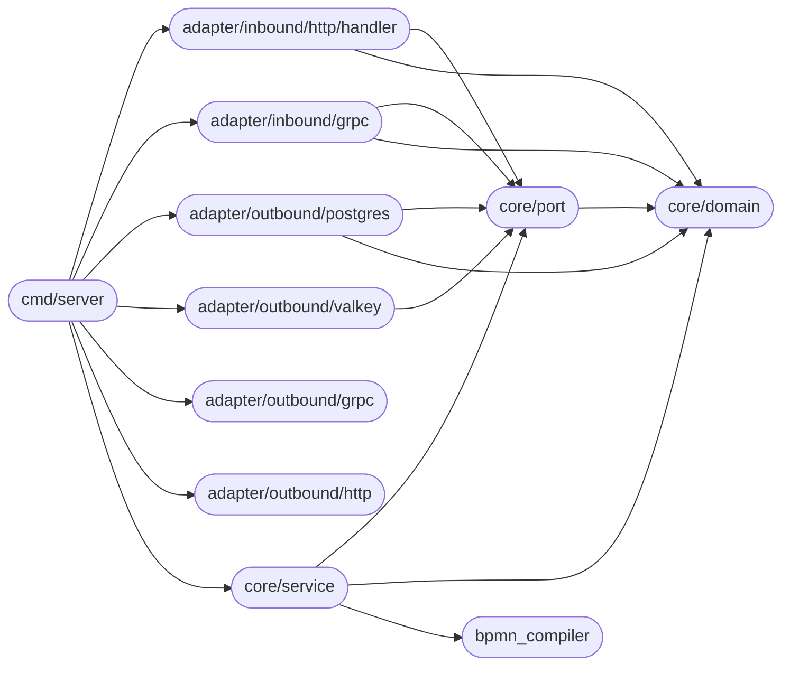
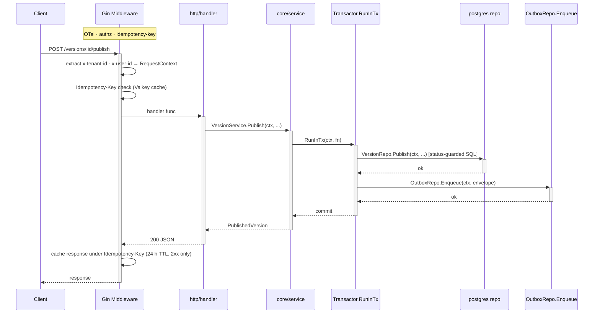
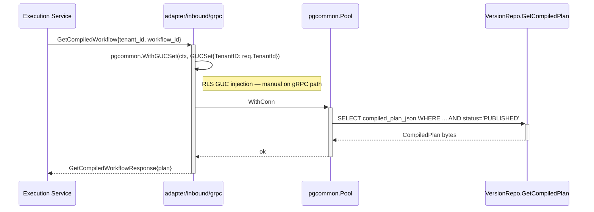
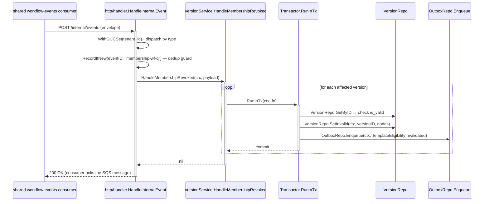
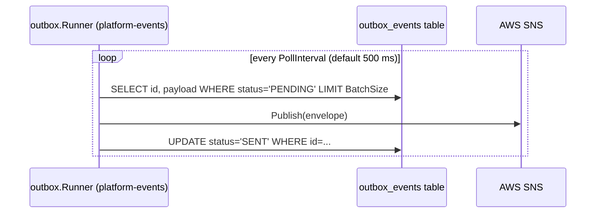

# Architecture

This document describes the internal structure, dependency rules, and runtime data flows of the `workflow-definition-service`.

> **Design intent:** this service is the design-time control plane of the BCBP Workflow Engine. It owns the full lifecycle of a workflow template — from raw BPMN XML through semantic validation, DSL compilation, and version state transitions — and exposes the resulting compiled plan to the Execution Service over gRPC.

---

## System context

Where the service sits in the broader platform:



---

## Layer model

The service follows Clean Architecture. Dependencies always point inward; nothing in `core/` imports from `adapter/`.



**Import rule:** `domain` → stdlib only. `port` → domain only. `service` → domain + port. `adapter/*` → port + domain. `cmd/server` → everything above. Nothing in `core/` imports from `adapter/`.

---

## Package dependency graph



---

## Key runtime flows

### 1. HTTP mutation (e.g. PublishVersion)



### 2. gRPC GetCompiledWorkflow



### 3. DepartmentMembershipRevoked (inbound via POST /internal/events)



### 4. Outbox relay

The `platform-events outbox.Runner` (started in `app.go`) runs independently:



The service never calls `FetchPending`, `MarkSent`, or `MarkFailed` — those are internal to the relay runner.

---

## Key invariants

| Invariant | Enforcement |
| --------- | ----------- |
| Single DRAFT per workflow | `UNIQUE INDEX idx_wv_single_draft ON workflow_version(workflow_id) WHERE status='DRAFT'` — DB-enforced; returns `ErrDraftAlreadyExists` on violation |
| Outbox must be inside a transaction | `OutboxRepo.Enqueue` returns an error if no `pgx.Tx` is present in context; the caller (service) is responsible for calling it only inside `Transactor.RunInTx` |
| Status-guarded mutations use `statusOrNotFound` | Publish/Archive SQL filters on `status=X`; on `RowsAffected()==0` a secondary `GetByID` distinguishes absent (→ `ErrNotFound`) from wrong-status (→ `ErrVersionNotDraft` etc.) — happy path is always single-query |
| `is_valid` reflects assignee eligibility only | `workflow_version.is_valid=false` means an assignee left a required department role; it does not reflect BPMN structural validity |
| Idempotency-Key scoped per tenant | Cache key format: `idem:<tenant_id>:<key>` — prevents cross-tenant replay; only 2xx responses are cached (24 h TTL) |
| gRPC path requires manual GUC injection | `WithGUCSet` must be called by the gRPC handler before any repo access; the HTTP path injects via `gincommon.ProtectedMiddlewares` automatically |
| `ProtectedMiddlewares` must wrap all protected routes | Missing middleware causes `RequestContext` lookup to fail → 500 (server misconfiguration, not 401) |

---

## Configuration reference

All configuration is loaded from environment variables (see `.env.example` for defaults).

| Variable | Default | Description |
| -------- | ------- | ----------- |
| `APP_ENV` | `dev` | `dev` or `prod`; controls logger format and OTel insecure mode |
| `HTTP_PORT` | `8080` | HTTP server port |
| `GRPC_PORT` | `9090` | gRPC server port |
| `DATABASE_URL` | — | PostgreSQL DSN (required) |
| `PG_MAX_CONNS` | `10` | Pool maximum connections |
| `PG_MIN_CONNS` | `2` | Pool minimum idle connections |
| `PG_SLOW_QUERY_THRESHOLD_MS` | `200` | Slow-query log threshold in milliseconds |
| `VALKEY_ADDR` | `localhost:6379` | Valkey (Redis-compatible) address |
| `VALKEY_PASSWORD` | — | Valkey auth password (empty = no auth) |
| `AWS_USE_STUB` | `true` | Use in-process no-op AWS stubs (local dev) |
| `AWS_REGION` | `us-east-1` | AWS region for SNS/SQS |
| `AWS_ENDPOINT_URL` | `http://localhost:4566` | Custom endpoint URL (LocalStack / testing) |
| `SNS_TOPIC_ARN` | — | SNS topic for domain events |
| `INTERNAL_API_TOKEN` | — | Shared secret for `POST /internal/events` (`x-internal-token`); empty disables the check |
| `OUTBOX_POLL_INTERVAL` | `500ms` | Outbox relay poll interval |
| `OUTBOX_BATCH_SIZE` | `50` | Outbox relay batch size |
| `ORG_MEMBERSHIP_BASE_URL` | — | IAM service base URL for eligibility checks (optional) |
| `EXECUTION_SERVICE_ADDR` | — | Execution service gRPC address (optional) |
| `OTEL_SERVICE_NAME` | `workflow-definition-svc` | OTel service name |
| `OTEL_EXPORTER_OTLP_ENDPOINT` | `localhost:4317` | OTel collector endpoint |
| `BUILD_VERSION` | `dev` | Build version injected at compile time via `-ldflags` |

---

## Error catalog

Domain sentinels defined in `internal/core/domain/errors.go`, mapped to HTTP responses in `internal/adapter/inbound/http/handler/errors.go`.

| Domain sentinel | HTTP status | API error code | Notes |
| --------------- | ----------- | -------------- | ----- |
| `ErrNotFound` / `pgx.ErrNoRows` | 404 | `NOT_FOUND` | |
| `ErrNoDraftExists` | 404 | `DRAFT_NOT_FOUND` | |
| `ErrUnauthorized` | 401 | `UNAUTHORIZED` | |
| `ErrForbidden` | 403 | `FORBIDDEN` | |
| `ErrPlanQuotaExceeded` | 403 | `PLAN_QUOTA_EXCEEDED` | Billing tier limit on workflow count |
| `ErrNoActiveVersion` | 409 | `NO_ACTIVE_VERSION` | Resource exists but has no PUBLISHED version |
| `ErrDraftAlreadyExists` | 409 | `DRAFT_ALREADY_EXISTS` | Partial-unique-index violation |
| `ErrDuplicateBusinessKey` | 409 | `DUPLICATE_BUSINESS_KEY` | |
| `ErrDraftConcurrency` | 409 | `DRAFT_CONCURRENCY` | Concurrent publish attempted |
| `ErrVersionNotDraft` / `ErrVersionNotPublished` / `ErrVersionAlreadyPublished` / `ErrInvalidVersionStatus` | 409 | `INVALID_VERSION_STATUS` | |
| `ErrActiveInstancesExist` | 409 | `ACTIVE_INSTANCES_EXIST` | Cannot archive a running workflow |
| `ErrStructuralDivergence` | 409 | `STRUCTURAL_DIVERGENCE` | Breaking schema change vs active version; use `force_publish_structural` to override |
| `ErrIdempotencyKeyReplay` | 409 | `IDEMPOTENCY_KEY_REPLAY` | Duplicate Idempotency-Key with different payload |
| `ErrAssigneeIneligible` | 422 | `ASSIGNEE_INELIGIBLE` | Assignee left required department role |
| `*ValidationFailedError` | 422 | `BPMN_VALIDATION_FAILED` | Structural/semantic BPMN errors; `invalid_params` carries per-node details |
| `ErrUpstreamUnavailable` | 503 | `UPSTREAM_UNAVAILABLE` | Downstream dependency (Execution Service, IAM) unreachable |
| any other | 500 | `INTERNAL_ERROR` | |

All error responses follow RFC 9457 (`application/problem+json`):

```json
{
  "type": "https://api.workflow.platform/errors/conflict",
  "title": "Draft Already Exists",
  "status": 409,
  "detail": "draft already exists",
  "instance": "/api/v1/workflows/abc/versions/draft",
  "code": "DRAFT_ALREADY_EXISTS"
}
```
