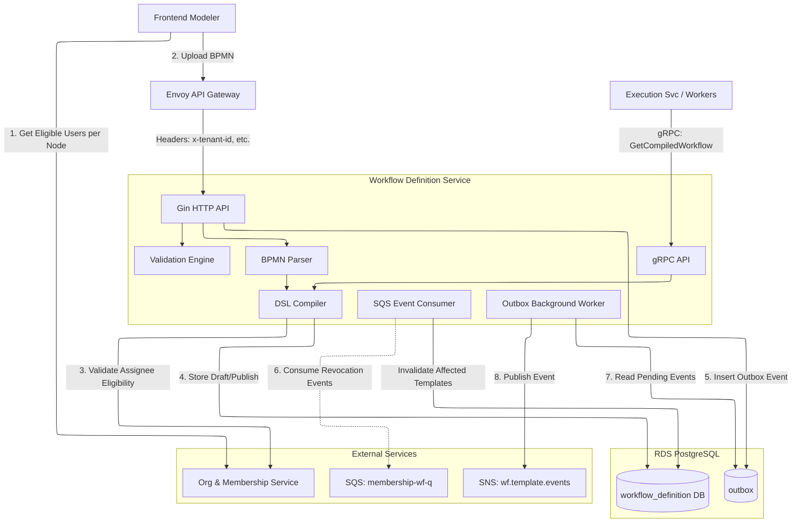
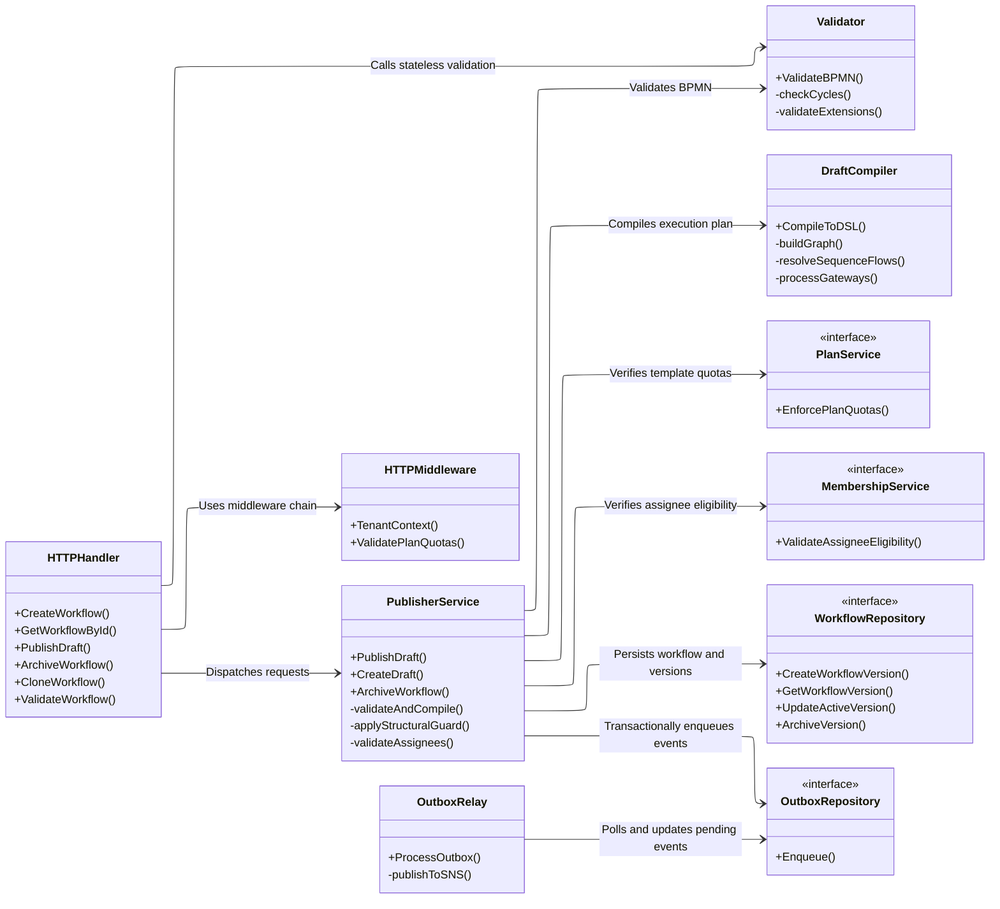
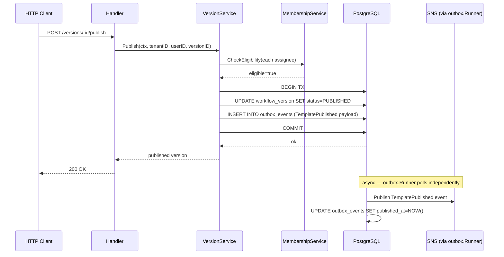
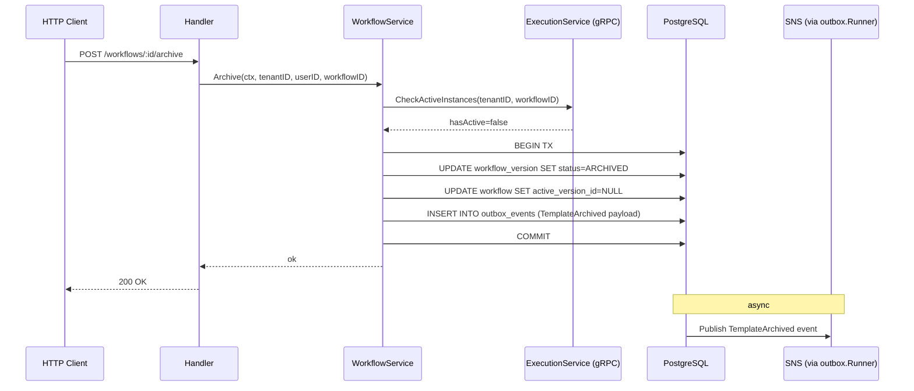
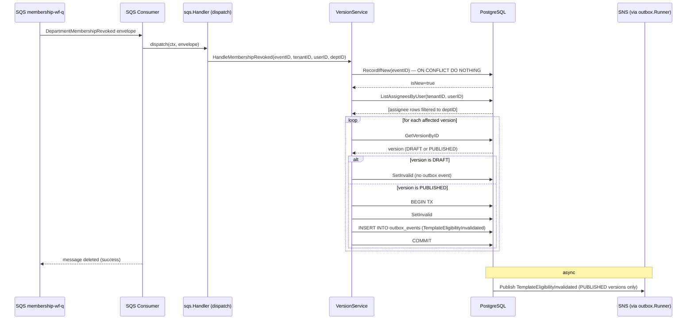
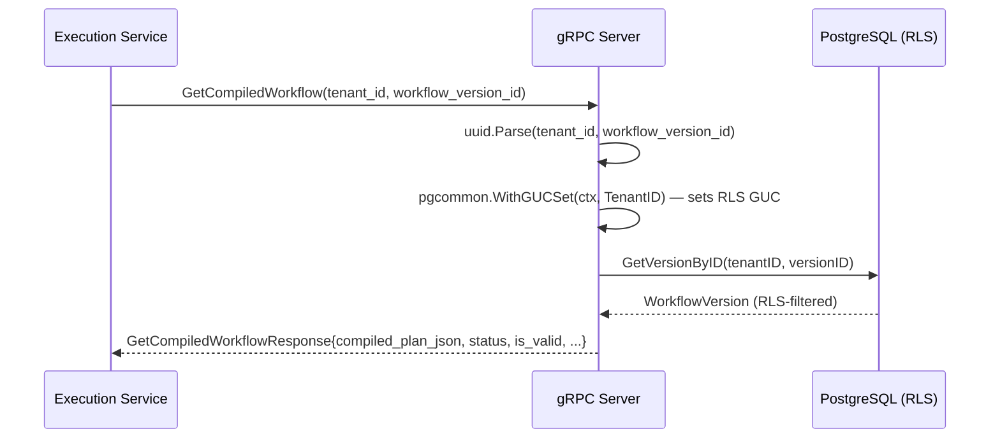

# Architecture

## Component diagrams

### High-level system view



### Component class diagram



---

## Clean architecture layers

The service enforces strict dependency direction — nothing in `core/` imports from `adapter/`.

```sh
cmd/server/             ← bootstrap + DI wire-up only (main.go, wire.go, app.go, infra.go, sqs.go)
│
├── internal/core/
│   ├── domain/             ← entities, enums, sentinel errors, event payloads
│   ├── port/               ← interface contracts (no implementations)
│   └── service/            ← business logic (imports domain + port only)
│
├── internal/adapter/
│   ├── inbound/
│   │   ├── http/           ← Gin handlers, authz, service-specific middleware
│   │   ├── grpc/           ← GetCompiledWorkflow server impl (reflection registered)
│   │   └── sqs/            ← DepartmentMembershipRevoked consumer dispatcher
│   └── outbound/
│       ├── postgres/       ← sqlc-generated DB layer + repo adapter impls
│       ├── grpc/           ← ExecutionClient (CheckActiveInstances)
│       ├── http/           ← MembershipClient (CheckEligibility)
│       └── valkey/         ← CacheStore impl (compiled plan cache, idempotency, draft lock)
│
├── internal/bpmn_compiler/ ← stateless XML parser, validator, DSL compiler
└── internal/config/        ← env var loading → typed Config struct
```

Import rules (enforced by `go-arch-lint`):

- `core/domain` → stdlib only
- `core/port` → `core/domain` only
- `core/service` → `core/domain` + `core/port`
- `adapter/*` → `core/port` + `core/domain`
- `bpmn_compiler` → `core/domain` only
- Nothing in `core/` or `bpmn_compiler/` imports from `adapter/`

## HTTP middleware chain

```sh
Incoming request
  → PanicRecovery          (gincommon) — JSON 500 on panic
  → RequestID              (gincommon) — reads/generates x-request-id
  → Tracing                (gincommon) — OTel span from traceparent
  → CorrelationHeaders     (gincommon) — writes X-Trace-ID, X-Request-ID
  → Metrics                (gincommon) — Prometheus http_requests_total etc.
  → Logging                (gincommon) — structured http_request log on close

  → /healthz, /readyz, /metrics        ← stop here (public)

  → RequireAuth            (gincommon) — validates x-user-id, x-tenant-id
  → ContextMiddleware      (gincommon) — builds RequestContext{TenantID, UserID, Roles, TraceID}

  → GET endpoints          ← read-only, no further authz

  → RequirePermission("write","workflow",authz)   ← POST/PUT/DELETE
  → handler
```

### Logger

`platform-gincommon/pkg/logger` exposes `NewLogger(env)` which returns a value that directly satisfies `port.Logger`. `app.go` calls `logger.NewLogger(cfg.AppEnv)` and passes the result into both `gincommon.Config{Logger: log}` and the service/handler constructors — no adapter wrapper is needed.

## gRPC interceptor chain

```sh
Incoming gRPC call
  → grpccommon.DefaultUnaryInterceptors   ← Prometheus grpc_server_* metrics, tracing
  → grpccommon.DefaultStreamInterceptors  ← same for streaming RPCs
  → DefinitionServiceServer.GetCompiledWorkflow
```

## Transactor pattern

Repository adapters participate in multi-step transactions via the `port.Transactor` interface:

```go
// Service layer — both writes commit or roll back atomically:
err := s.transactor.RunInTx(ctx, func(ctx context.Context) error {
    if err := s.versionRepo.Publish(ctx, ...); err != nil {
        return err
    }
    return s.outboxRepo.Enqueue(ctx, env)
})
```

`Transactor.RunInTx` begins a `pgx.Tx`, stores it in context under a private key, runs the callback, and commits or rolls back. Every repo adapter calls the internal `exec(ctx, pool, fn)` helper, which checks for a transaction in context first and falls back to `pool.WithConn` for non-transactional reads. This means:

- **pgx types never escape** `adapter/outbound/postgres/` — the transaction lifecycle is entirely encapsulated.
- **Service layer has no pgx imports** — it only calls `port.Transactor`.
- **`OutboxRepository.Enqueue` must be called inside `RunInTx`** — it returns an error otherwise (the tx enforcement is explicit in the implementation).

---

## Outbox pattern

Business mutations and their associated domain events are written in the same PostgreSQL transaction. The service enqueues events using `outbox.Enqueue` inside the database transaction. A background `outbox.Runner` worker (from `platform-events`) polls the `outbox_events` table where `published_at IS NULL` and `scheduled_at <= NOW()`, dispatches to SNS, and marks them published.

### Publish draft — sequence



### Archive workflow — sequence



### DepartmentMembershipRevoked — sequence



### GetCompiledWorkflow (gRPC) — sequence



## Repository error semantics

### Fine-grained version-status sentinels

`internal/core/domain/errors.go` defines three status-specific sentinels returned by repo adapters when a status-guarded mutation is attempted on a version in the wrong state:

| Sentinel | Returned when |
| --- | --- |
| `ErrVersionNotDraft` | Mutation requires DRAFT; version exists but is not DRAFT |
| `ErrVersionNotPublished` | Mutation requires PUBLISHED; version exists but is not PUBLISHED |
| `ErrVersionAlreadyPublished` | Publish attempted on an already-PUBLISHED version |

Do not collapse these into `ErrNotFound`. The service layer maps each to a distinct HTTP catalog code.

### `statusOrNotFound` probe

Status-guarded SQL mutations (`PublishVersion`, `ArchiveVersion`, `UpdateDraft`, `DeleteDraft`) filter on `status` in their WHERE clause (e.g. `WHERE tenant_id=$1 AND id=$2 AND status='DRAFT'`). On `RowsAffected() == 0` — which means either the record is absent or it exists in the wrong status — Go calls `statusOrNotFound` to do a secondary `GetWorkflowVersionByID` and disambiguate:

```text
RowsAffected() > 0  →  success (single query)
RowsAffected() == 0 →  secondary read: GetWorkflowVersionByID
                         absent  →  ErrNotFound
                         present →  wrongStatusErr (ErrVersionNotDraft etc.)
```

The happy path is always a single query. The probe only fires on the exceptional case (wrong status or missing record), keeping read amplification off the hot path.

---

## Valkey usage

| Purpose | Key pattern | TTL |
| --- | --- | --- |
| Compiled plan cache | `plan:{tenant_id}:{version_id}` | 5 min |
| Idempotency key | `idempotency:{tenant_id}:{key}` | 24 h |
| Draft edit lock | `draft_lock:{tenant_id}:{workflow_id}` | 30 s (refreshed) |
