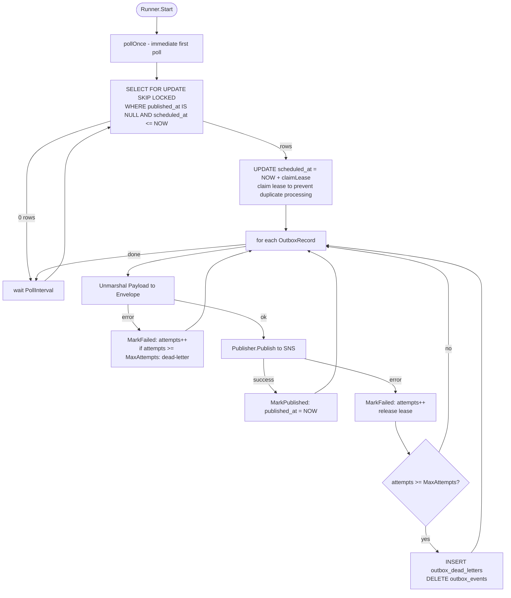

# platform-events

Module: `github.com/BCBP-SOLUTIONS-FZC-LLC/platform-events`

Provides SNS publisher, SQS consumer, transactional outbox runner, and typed event envelopes for all platform services. The definition service uses this for all outbound event publishing and inbound membership-revocation consumption.

---

## Event Envelope

`Envelope[T]` is the canonical wire format. Always construct with `NewEnvelope` — it generates a UUID v7 `ID` and sets `Timestamp` automatically. Always pass both `WithTenantID` and `WithTraceID` so the consumer-side span links back to the publisher's trace across the SNS/SQS boundary.

The definition service builds envelopes from the service layer via `buildEnvelope` in `internal/core/service/helpers.go`. Because the service layer does not have access to the Gin context, it extracts the trace ID directly from the OTel span stored in `ctx`:

```go
import (
    "context"
    "encoding/json"
    "go.opentelemetry.io/otel/trace"
    "github.com/BCBP-SOLUTIONS-FZC-LLC/platform-events/pkg/events"
)

opts := []events.EnvelopeOpt{events.WithTenantID(tenantID)}
if sc := trace.SpanFromContext(ctx).SpanContext(); sc.IsValid() {
    opts = append(opts, events.WithTraceID(sc.TraceID().String()))
}
env := events.NewEnvelope[json.RawMessage](eventType, source, raw, opts...)
```

`sc.IsValid()` is false on non-traced paths (unit tests, stub runners) so no zero trace ID is attached. On the HTTP path the span is created by gincommon's `TracingMiddleware`; on the SQS path the consumer injects it from `env.TraceID`.

> **If you are building envelopes at the HTTP handler layer** (direct Gin context access), use `rc.TraceID` from `gincommon.RequestContext(c)` instead — it is the same OTel trace ID already stringified.

Envelope JSON shape:

```json
{
  "id":        "01926e4f-...",
  "type":      "wf.template.published",
  "source":    "workflow-definition-service",
  "tenant_id": "acme",
  "trace_id":  "4bf92f3577...",
  "timestamp": "2026-05-27T12:00:00Z",
  "payload":   { ... }
}
```

Envelope JSON shape:

```json
{
  "id":        "01926e4f-...",
  "type":      "wf.template.published",
  "source":    "workflow-definition-service",
  "tenant_id": "acme",
  "trace_id":  "4bf92f3577...",
  "timestamp": "2026-05-27T12:00:00Z",
  "payload":   { ... }
}
```

---

## Transactional Outbox

The outbox eliminates the dual-write problem: business write + event enqueue commit atomically; the runner publishes asynchronously.

### Enqueue (inside a business transaction)

```go
import (
    "github.com/BCBP-SOLUTIONS-FZC-LLC/platform-events/pkg/outbox"
    "github.com/BCBP-SOLUTIONS-FZC-LLC/platform-pgcommon/pkg/pgcommon"
)

err = pgcommon.RunInTx(ctx, pool, pgx.TxOptions{}, func(ctx context.Context, tx pgx.Tx) error {
    if err := versionRepo.Publish(ctx, ...); err != nil { return err }
    return outbox.Enqueue(ctx, tx, env)  // same transaction
})
```

> **The definition service wraps this in `Transactor.RunInTx`.** The `OutboxRepository.Enqueue` adapter extracts the tx from context and calls `outbox.Enqueue(ctx, tx, env)` internally.

### Outbox poll cycle



### Runner wiring (app.go)

```go
runner := outbox.NewRunner(outbox.Config{
    Pool:        pool,
    Publisher:   snsPublisher,
    Logger:      log,
    PollInterval: 5 * time.Second,
    BatchSize:   50,
    MaxAttempts: 5,
})
go runner.Start(ctx)
defer runner.Stop()
```

---

## SNS Publisher

```go
publisher, err := events.NewSNSPublisher(events.SNSConfig{
    TopicARN: cfg.SNSTopicARN,
    Region:   cfg.AWSRegion,
    Logger:   log,   // accepts port.Logger — pass gincommon ZapLogger directly
})
```

`PublishBatch` splits automatically at 10 (SNS hard limit). SNS message attributes (`EventType`, `TenantID`, `Source`, `EventID`) are always set for SQS subscription filter policies.

**Mock for tests:**

```go
import "github.com/BCBP-SOLUTIONS-FZC-LLC/platform-events/pkg/events/mock"

pub := mock.NewMockPublisher()
// inject pub into the service
published := pub.Published() // []Envelope[json.RawMessage]
```

---

## SQS Consumer

```go
consumer, err := events.NewSQSConsumer(
    events.SQSConfig{
        QueueURL: cfg.SQSQueueURL,
        Region:   cfg.AWSRegion,
        Logger:   log,
    },
    func(ctx context.Context, env events.Envelope[json.RawMessage]) error {
        // handler — ctx has TenantID + TraceID injected for RLS GUC
        return handleMembershipRevoked(ctx, env)
    },
    events.WithConcurrency(cfg.SQSConcurrency),
)
go consumer.Start(ctx)
defer consumer.Stop()
```

Returning a non-nil error from the handler leaves the message visible (retry). The handler `ctx` has `env.TenantID` and `env.TraceID` injected so `pgcommon.Pool` GUC injection scopes all DB queries to the correct tenant automatically.

---

## Key configuration

| Env var | Default | Notes |
|---------|---------|-------|
| `SNS_TOPIC_ARN` | — | Required when `AWS_USE_STUB=false` |
| `SQS_QUEUE_URL` | — | Required when `AWS_USE_STUB=false` |
| `SQS_CONCURRENCY` | `1` | Parallel handler goroutines |
| `OUTBOX_POLL_INTERVAL` | `5s` | |
| `OUTBOX_BATCH_SIZE` | `50` | Records per poll cycle |
| `OUTBOX_MAX_ATTEMPTS` | `5` | Before dead-letter |
| `AWS_USE_STUB` | `true` | Set `false` in staging/production |
