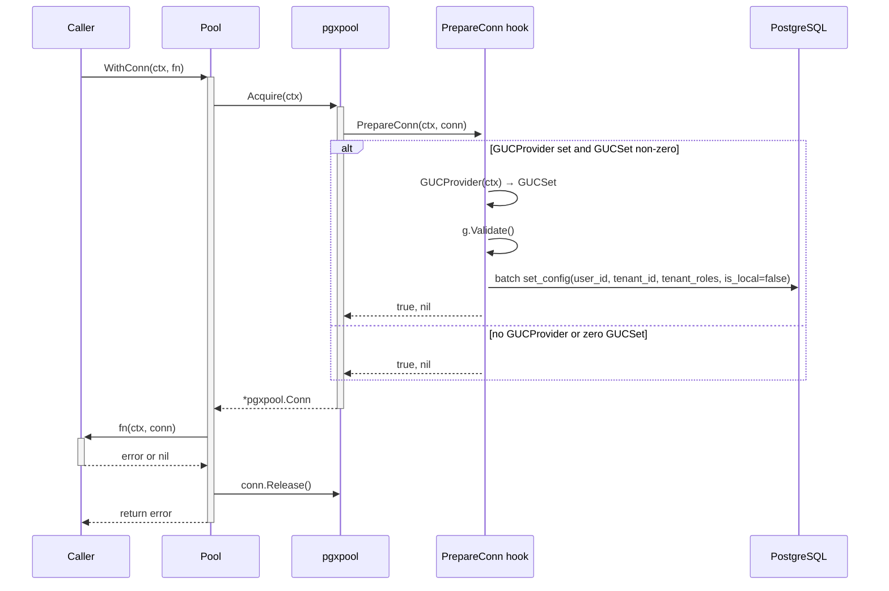

# platform-pgcommon

Module: `github.com/BCBP-SOLUTIONS-FZC-LLC/platform-pgcommon`

Provides the PostgreSQL connection pool with RLS GUC injection, transaction helpers, slow-query tracing, and a migration runner. All repository adapters in `internal/adapter/outbound/postgres/` depend on this library.

---

## Pool setup

```go
import (
    "github.com/BCBP-SOLUTIONS-FZC-LLC/platform-pgcommon/pkg/pgcommon"
    "github.com/BCBP-SOLUTIONS-FZC-LLC/platform-pgcommon/pkg/pgmetrics"
)

// Call once at startup alongside events.Init — registers pgcommon_* Prometheus counters.
pgmetrics.Init(cfg.OTELServiceName, cfg.BuildVersion)

pool, err := pgcommon.NewPool(ctx, pgcommon.Config{
    DSN:                cfg.DatabaseURL,
    MaxConns:           cfg.PGMaxConns,
    MinConns:           cfg.PGMinConns,
    SlowQueryThreshold: time.Duration(cfg.PGSlowQueryThresholdMS) * time.Millisecond,
    GUCProvider:        pgcommon.GUCSetFromContext,  // auto-injects tenant_id, user_id, roles on every connection
})
```

`GUCSetFromContext` reads the `GUCSet` stored by `WithGUCSet(ctx, gs)` — the `InjectGUCSet` middleware does this for every authenticated HTTP request (see Decision 23 in CLAUDE.md).

> **`Config.Logger` and `Config.Tracer` are not wired.** The library's internal `port.Logger` and `port.Tracer` interfaces use unexported `port.Field` types, making them unimplementable by external packages. `SlowQueryThreshold` still triggers slow-query events internally; they will appear in structured logs once the library exports those types.

## Prometheus metrics (`pgmetrics`)

`pgmetrics.Init` registers the following Prometheus counters with the default registerer:

| Metric                                   | Description                                                   |
| ---------------------------------------- | ------------------------------------------------------------- |
| `pgcommon_query_total`                   | Total queries by status (`ok` / `error`)                      |
| `pgcommon_pool_acquire_total`            | Pool connections acquired                                     |
| `pgcommon_pool_acquire_duration_seconds` | Histogram of acquire wait times                               |
| `pgcommon_retry_total`                   | Transaction retries by reason (`deadlock` / `serialization`)  |
| `pgcommon_slow_query_total`              | Queries exceeding `SlowQueryThreshold`                        |

`pgmetrics.Init` is idempotent — safe to call multiple times (e.g., in tests that call `main` directly).

---

## Connection lifecycle

### Single query (`WithConn`)



### Transaction (`RunInTx`)

```mermaid
sequenceDiagram
    participant Caller
    participant RunInTx
    participant DB as PostgreSQL

    Caller ->>+ RunInTx: RunInTx(ctx, pool, opts, fn)
    RunInTx ->>+ DB: pool.BeginTx(ctx, opts)
    DB -->>- RunInTx: tx

    RunInTx ->>+ Caller: fn(ctx, tx)

    alt fn returns nil
        Caller -->>- RunInTx: nil
        RunInTx ->> DB: tx.Commit(ctx)
        RunInTx -->> Caller: nil
    else fn returns error
        Caller -->> RunInTx: error
        RunInTx ->> DB: tx.Rollback(context.Background())
        RunInTx -->>- Caller: fn error
    else fn panics
        RunInTx ->> DB: tx.Rollback(context.Background())
        RunInTx ->>- Caller: re-panic
    end
```

---

## Transactor pattern (definition service)

Repos participate in multi-step transactions without leaking pgx types into the port layer. The `Transactor` adapter stores the `pgx.Tx` in context:

```go
// Service layer — no pgx imports needed
err = s.transactor.RunInTx(ctx, func(ctx context.Context) error {
    if err := s.versionRepo.Publish(ctx, ...); err != nil { return err }
    return s.outboxRepo.Enqueue(ctx, env)
})
```

Repos call `exec(ctx, pool, fn)` which checks context for a tx first:

```go
// In base.go — adapter layer only
func exec(ctx context.Context, pool *pgcommon.Pool, fn func(db.DBTX) error) error {
    if tx, ok := txFromContext(ctx); ok {
        return fn(tx)
    }
    return pool.WithConn(ctx, func(_ context.Context, conn *pgxpool.Conn) error {
        return fn(conn)
    })
}
```

---

## Retry on deadlock

```go
err = pgcommon.RunInTxWithRetryOpts(ctx, pool, pgx.TxOptions{
    IsoLevel:   pgx.Serializable,
    AccessMode: pgx.ReadWrite,
}, pgcommon.RetryOptions{
    MaxAttempts:    5,
    InitialWait:    10 * time.Millisecond,
    MaxWait:        500 * time.Millisecond,
    Multiplier:     2.0,
    JitterFraction: 0.25,
}, func(ctx context.Context, tx pgx.Tx) error {
    return doWork(ctx, tx)
})
```

Retries automatically on SQLSTATE `40P01` (deadlock) and `40001` (serialization failure).

---

## Error helpers

```go
if pgcommon.IsUniqueViolation(err) {
    switch pgcommon.ConstraintName(err) {
    case "workflow_tenant_id_business_key_key":
        return domain.ErrDuplicateBusinessKey
    case "idx_wv_single_draft":
        return domain.ErrDraftAlreadyExists
    }
}
if errors.Is(err, pgx.ErrNoRows) {
    return domain.ErrNotFound
}
```

All helpers work with wrapped errors (`errors.As` internally).

---

## Key configuration

| Env var | Default | Notes |
|---------|---------|-------|
| `DATABASE_URL` | — | Required |
| `PG_MAX_CONNS` | `10` | Pool max |
| `PG_MIN_CONNS` | `2` | Pool min idle |
| `PG_SLOW_QUERY_THRESHOLD_MS` | `200` | Log slow queries at WARN |
